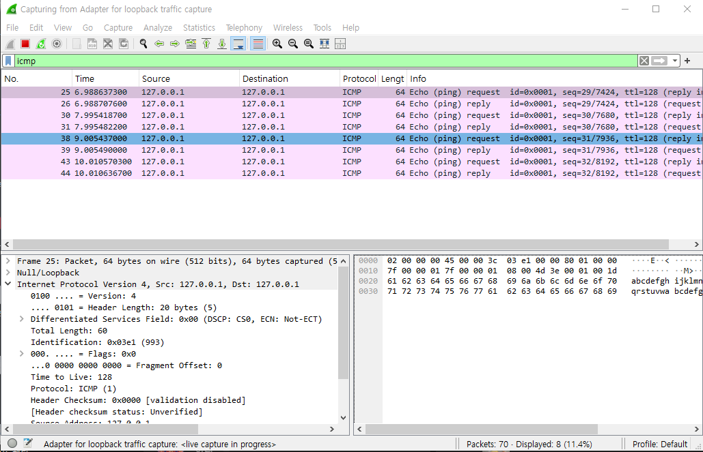
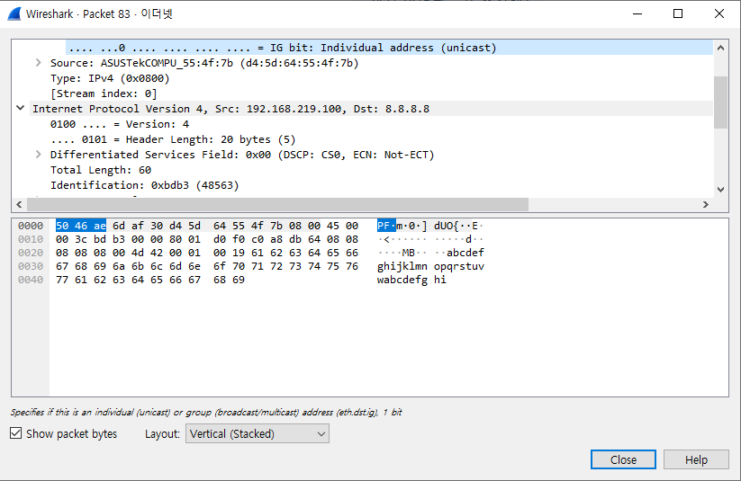

# 02-ping-and-packet-capture

## 1. 目的 (Objective)

この実習では、Pingを実行した際のトラフィックをWiresharkでキャプチャし、パケットの内容を確認する。

## 2. 環境 (Environment)

- OS : Windows
- Tools / Commands : Wireshark、`ping`

## 3. 実習 (Practice)

### Step 1. 外部ホストへのPing

Wiresharkでイーサネットインターフェースを選択し、以下のフィルターを設定した。

```text
icmp
```

以下のコマンドを実行した。

```bash
ping 8.8.8.8
```

ICMP Echo RequestとEcho Replyをキャプチャした。

### Step 2.  IPv4ヘッダの確認

キャプチャしたICMP Echo Requestを選択し、IPv4ヘッダを確認した。

確認した項目 ：

- Source Address
- Destination Address
- TTL
- Protocol
- Total Length

### Step 3. イーサネットヘッダの確認

キャプチャしたICMP Echo Requestを選択し、イーサネットヘッダを確認した。

確認した項目 ：

- Destination
- Source
- Type

### Step 4. ループバック通信との比較

Ethernetインターフェースを選択した状態で、以下のコマンドを実行した。

```bash
ping 127.0.0.1
```

次にLoopbackインターフェースを選択し、同じコマンドを実行した。

## 4. 結果 (Result)

### 8.8.8.8

ICMP Echo Request / Replyを確認した。



#### IPv4ヘッダ

- Source Address : `192.168.219.100`
- Destination Address : `8.8.8.8`
- TTL : `128`
- Protocol : `ICMP`
- Total Length : `60 bytes`

#### イーサネットヘッダ

- Destination : `50:46:ae:6d:af:30`
- Source : `d4:5d:64:55:4f:7b`
- Type : `IPv4`

### 127.0.0.1

- イーサネットインターフェースではICMPパケットを確認できなかった。
- ループバックインターフェースではICMP Echo Request / Replyを確認できた。



## 5. 結果の分析 (Analysis)

- Wiresharkを使用することで、外部ホストへのPingで発生するICMPトラフィックを実際に確認できた。
- ループバックアドレス宛てのICMPパケットはイーサネットインターフェースではキャプチャされず、ループバックインターフェースではキャプチャされた。
- この結果から、ループバック通信は物理ネットワークへ送信されず、ホスト内部で処理されることを確認できた。

## 6. 学びと考察 (Learning & Insights)

-    
-
-